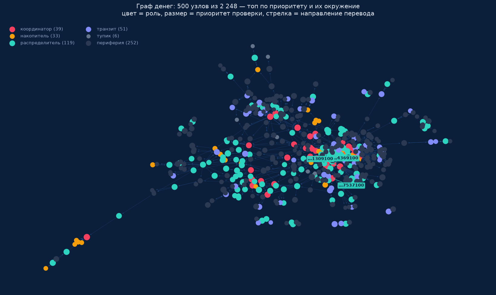
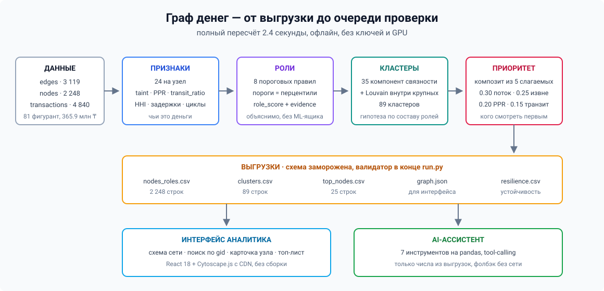

# Граф денег — кого из 2 248 клиентов проверять первым

Команда **Natural Intelligence** · HackAlem AI, трек «Финансы»

---

## 1. Что это и какую задачу решает

У AML-аналитика есть **81 известный фигурант** по делу о незаконном обороте наркотиков
и выгрузка внутрибанковских переводов вокруг них: 2 248 клиентов, 3 119 связей,
4 840 транзакций, оборот 365.9 млн KZT. Ручная трассировка одной цепочки на 4 колена —
часы работы. Начинать надо с кого-то конкретного, и вопрос звучит так:
**кого из 2 248 смотреть первым и почему**.

### Что инструмент нашёл в этих данных

Из 2 248 счетов он выделяет **39 координаторов** и **36 точек консолидации** — это и есть
уровень выше известных фигурантов.

Показательный узел — `100000000331309100`, второе колено обхода. Внутри графа он получил
**985 тыс.**, а разослал **23.0 млн на 99 получателей**. Разница в **22 млн** пришла
из-за пределов выборки, и это не единичный случай: **335 счетов влили в сеть 229.9 млн —
63% всего наблюдаемого оборота**. Аналитик получает по такому узлу не оценку «высокий риск»,
а строку, которую можно проверить по выписке, и готовый следующий шаг — запросить входящие.

### Что делает инструмент

Восстанавливает **роль каждого участника** (кто собирает деньги, кто раздаёт, кто прогоняет
транзитом, где деньги оседают), разбивает сеть на связанные фрагменты и выдаёт
**ранжированный список проверки** с обоснованием по каждому узлу.

Каждый вывод — числа из данных, а не скор непрозрачной модели. Роль объясняется за минуту
по одной строке `evidence`. Все заключения — гипотезы для проверки, а не утверждения
о виновности (§14).



*500 узлов из 2 248: топ по приоритету и их окружение. Цвет — роль, размер — приоритет
проверки, стрелка — направление перевода. Интерактивная версия с поиском по gid —
`python app.py`.*

---

## 2. Запуск

### Выгрузки — одна команда

```bash
pip install -r requirements.txt && python run.py
```

Пересчёт — **около 15 секунд** (лимит ТЗ —
5 минут, запас двадцатикратный). Основное время занимают 2 000 прогонов конфигурационной
модели для z-скора структурных мотивов (§5); без них пайплайн отрабатывает за полторы секунды.

Проверено на Python 3.12 / Windows 11 **в чистом venv** и на свежем `git clone` — без
ручных шагов, ни одной зависимости сверх `requirements.txt`.

### Интерфейс — вторая команда

```bash
python app.py     # http://localhost:8000
```

Ассистенту нужен ключ DeepSeek в `.env` (образец — `.env.example`). Без ключа он не падает,
а отвечает шаблонами на тех же функциях — см. §12.

### Стек

Пять pip-пакетов, **никакого npm, никакого GPU, никакой внешней БД**.

| Слой | Технология | Почему так |
|---|---|---|
| Граф и признаки | `networkx` + `pandas` | 2 248 узлов считаются за секунды в памяти; графовая БД здесь только добавила бы накладных расходов (§13) |
| Роли и приоритет | пороговые правила на `numpy` | ТЗ запрещает чёрный ящик: каждая роль обязана иметь объяснимое правило |
| Значимость мотивов | `scipy` | конфигурационная модель и поправка на множественные сравнения |
| Сервер | `FastAPI` + `uvicorn` | ключ LLM остаётся на бэке и в браузер не попадает |
| Интерфейс | `React 18` + `Cytoscape.js` через CDN | ноль сборки: `npm install` на чужой машине — лотерея, а это 25 баллов за воспроизводимость |
| Автономная схема | `pyvis` | `out/graph.html` открывается двойным кликом без сервера — страховка на демо |
| Ассистент | DeepSeek `deepseek-flash`, tool-calling | опционален; пайплайн и выгрузки от него не зависят |

Машинного обучения в решении нет намеренно — обоснование в §6.

### Что появляется на выходе

```
out/nodes_roles.csv    2 248 строк — роль, уверенность, кластер, приоритет, обоснование
out/clusters.csv          89 строк — состав и гипотеза по каждому кластеру
out/top_nodes.csv         25 строк — топ-лист проверки с объяснением и следующим запросом
out/graph.json                     — подготовленный граф для веб-интерфейса
out/resilience.csv         4 строки — устойчивость сети при изъятии топ-N узлов (§9)
out/motifs.csv                     — пары узлов с общими получателями и посредниками (§5)
out/graph.html                     — автономная схема, открывается без сервера
```

Три первых файла — обязательные по ТЗ. Остальные закрывают опциональные пункты
и страхуют демо.

В конце `run.py` сам прогоняет валидатор — ровно те проверки, которые сделает жюри:
2 248 строк, роли из словаря, `evidence` непустой и ≤200 символов, скоры в [0, 1],
`cluster_id` проставлен у всех. При расхождении падает с внятной ошибкой.

### Как этим пользоваться: сценарий аналитика

Сквозной путь от списка фигурантов до перечня на проверку — пять шагов из §3 ТЗ.

1. **Положить выгрузку в `data/`** (три parquet) и выполнить `python run.py`.
   Через 15 секунд готовы три CSV.
2. **Открыть `python app.py` → localhost:8000.** Слева топ-лист приоритетов,
   в центре схема сети, справа карточка узла и чат с ассистентом.
3. **Начать с топ-листа.** Первые строки — узлы, которые стоит смотреть раньше прочих.
   Клик по строке подсвечивает узел на схеме и открывает карточку.
4. **Прочитать обоснование.** В карточке — роль, уверенность в ней, строка `evidence`
   с числами и крупнейшие контрагенты в обе стороны. Этого достаточно, чтобы решить,
   брать ли узел в работу.
5. **Проверить конкретный счёт.** Ввести любой из 2 248 `gid` в поиск — узел находится
   даже если не попал в отрисованную часть схемы, его окружение подгружается отдельно.
6. **Сформировать перечень.** Колонка `next_request` в `top_nodes.csv` говорит, какой
   запрос закроет белое пятно по каждому узлу: входящие переводы, исходящие за границей
   обхода или операции ниже порога 5 000 KZT (§11).

Спросить ассистента можно словами: «кто собирает деньги с этих пятерых?» — ответ придёт
со ссылками на конкретные `gid`, которые подсветятся на схеме.

### Если что-то пошло не так

| Симптом | Причина и что делать |
|---|---|
| `python app.py` — порт занят | Интерфейс поднимается на 8000. Освободить порт или запустить `uvicorn app:app --port 8010` |
| Ассистент отвечает шаблонами | Нет `DEEPSEEK_API_KEY`. Это штатный режим: скопировать `.env.example` в `.env` и вписать ключ, либо работать без него |
| `out/graph.html` пустой или 0 байт | Локаль без UTF-8. Исправлено в `src/viz.py`, но если повторится — `PYTHONUTF8=1 python run.py` |
| `nx.pagerank` падает | Не установлен `scipy`. Он есть в `requirements.txt` — проверьте, что установка прошла целиком |
| Выгрузки не совпали с ожиданием жюри | `run.py` сам печатает, какая проверка не прошла и почему |

---

## 3. Схема решения



```
data/*.parquet  ──►  features.py  ──►  roles.py  ──►  clusters.py  ──►  priority.py
 edges  3 119        24 признака      8 правил      WCC + Louvain     композит из 5
 nodes  2 248        на узел          на узел       89 кластеров      слагаемых
 tx     4 840                              │
                                           ▼
            out/nodes_roles.csv · clusters.csv · top_nodes.csv · graph.json · resilience.csv
                                           │
                        ┌──────────────────┴──────────────────┐
                        ▼                                     ▼
              app.py + web/index.html              src/agent.py + src/tools.py
              схема сети, поиск по gid              8 инструментов, tool-calling
```

---

## 4. Критерии ролей с порогами

### Словарь ролей

Шесть ролей из ТЗ плюс одно расширение. ТЗ разрешает расширять словарь при условии,
что расширение задокументировано — документируем:

| Роль | Смысл |
|---|---|
| `consolidator` | точка консолидации — аккумулирует средства от нескольких участников |
| `transit` | транзитный счёт — пропускает средства дальше, не удерживая |
| `distributor` | веерное распределение средств на много получателей |
| `terminal` | конечный получатель — деньги приходят и остаются |
| `coordinator` | координирующий узел, кандидат в организаторы |
| `peripheral` | периферия, признаков роли не выявлено |
| **`terminal_unknown`** | **расширение словаря.** Узел выглядит конечным, но стоит на 4-м колене, где обход графа оборван. Отличить «деньги осели» от «мы не досмотрели» по этим данным нельзя, поэтому такие узлы вынесены отдельно и не засчитываются как `terminal` |

Расширение закрывает конкретную проблему: без него 444 артефакта обрыва выгрузки смешались бы
с 1 091 настоящим стоком и раздули бы долю `terminal` до 1 535 узлов — вывод, которого
данные не подтверждают.

### Правила

Правила проверяются **сверху вниз, первое совпадение выигрывает**.

| # | Роль | Условие | Узлов |
|---|---|---|---|
| 1 | `peripheral` | нет ни одного перевода ≥ 5 000 KZT (изолированные) | 19 |
| 2 | `terminal_unknown` | `out_deg = 0` и `depth = 4` — обход оборван | 444 |
| 3 | `terminal` | `out_deg = 0` и `depth ≤ 3` — узел разворачивали, исходящих нет | 1 091 |
| 4 | `coordinator` | есть вход и выход, деньги от ≥ 2 фигурантов, и `in_deg ≥ 4` при `out_deg ≥ 5` (либо крупный оборот при `in_deg ≥ 3`, `out_deg ≥ 3`) | 39 |
| 5 | `consolidator` | `in_deg ≥ 4` и `net_flow ≥ +0.30` | 36 |
| 6 | `distributor` | `out_deg ≥ 10` и `net_flow < +0.30` (узел не накопитель) и `hhi_out < 0.30` | 151 |
| 7 | `transit` | есть вход и выход, `transit_ratio ≥ 0.80` | 76 |
| 8 | `peripheral` | всё остальное | 392 |

Всего `peripheral` — 411 узлов: 392 по правилу 8 плюс 19 изолированных по правилу 1.

Константы лежат в одном месте — начало [`src/roles.py`](src/roles.py), README цитирует их дословно.

### Почему пороги именно такие

- **`in_deg ≥ 4`** для `consolidator` — верхние ~3% узлов, у которых есть входящие.
  **`out_deg ≥ 10`** для `distributor` — верхние ~7% узлов с исходящими.
- **Пороги заданы числами, а не перцентилями.** На этом графе перцентили вырождаются:
  медиана `in_deg` равна 1, поэтому P90 даёт порог 2 и правило пропускает почти всех подряд.
  Рядом с каждым числом в коде указано, какой доле распределения оно соответствует —
  именно это и объясняется жюри.
- **`transit_ratio ≥ 0.80`** — `min(вход, выход) / max(вход, выход)`. Значение 0.8 означает
  «вход и выход сходятся в пределах 20%». Метрика ограничена отрезком [0, 1] и не взрывается
  на seed-узлах, у которых входящие занижены по построению выгрузки.
- **`net_flow = ±0.30`** — нормированная разность `(вход − выход) / (вход + выход)`.
  Знак разделяет накопление и раздачу, 0.3 отсекает узлы с перекосом в пределах обычного шума.
- **`hhi_out < 0.30`** — индекс Херфиндаля по долям получателей. Отличает настоящий веер
  от «раздачи» двоим: 99 получателей с равными долями дают HHI 0.02, два по 50/50 — 0.50.
- **`taint_share`** — haircut-трассировка от 81 фигуранта: какая доля входящих денег узла
  пришла от них. Seed = 1.0 по определению, остальные получают средневзвешенную по суммам
  долю своих плательщиков, итеративно до сходимости (граф не DAG — 177 взаимных пар).
  В правила ролей **не входит** и в приоритет **не входит**: у 75% узлов он равен ровно 1.0,
  потому что граф построен обходом от seed. Остаётся в `evidence` как контекст.

### Второй путь в роль — по деньгам, а не по числу связей

Правила выше отбирают узлы **по числу контрагентов**. Но структурный признак бывает виден
и там, где контрагентов всего два: если через узел прошёл крупный поток или у него заметный
разрыв «отдал минус получил». Поэтому роль назначается **двумя путями**:

| Путь | Условие | `role_score` |
|---|---|---|
| По числу контрагентов | пороги из таблицы выше | обычный |
| По объёму | оборот в верхних 10% выборки **или** разрыв «отдал минус получил» выше медианы среди тех, у кого он есть | **низкий** — признак есть, но слабый |

Направление роли во втором случае задаёт знак `net_flow`: накапливает — `consolidator`,
раздаёт — `distributor`.

**Зачем это нужно.** Узел с заметным внешним финансированием не может считаться периферией:
структурный признак у него есть, просто он виден не по числу связей, а по происхождению денег.
Без второго пути такие узлы получали роль `peripheral` с обоснованием «признаков роли
не выявлено» и **одновременно стояли третьими в топе приоритета** — прямое противоречие,
которое жюри заметило бы сразу. Низкий `role_score` при этом честно говорит, насколько
слабое это основание.

### Уверенность в роли (`role_score`)

```
role_score = sigmoid(k · (признак − порог)) × (1 − штраф_за_артефакт)
```

Штраф — это не декорация, а прямой ответ на вопрос «почему 0.3, а не 0.9»:

| Ситуация | Штраф | Причина |
|---|---|---|
| `depth = 4` | 0.40 | обход оборван, конечность узла не подтверждена |
| seed-клиент | 0.30 | входящие суммы занижены по построению выгрузки |

Поэтому все 444 узла `terminal_unknown` имеют ровно `role_score = 0.30`: мы честно говорим,
что это не вывод, а граница наших данных.

### Приоритет проверки (`priority_score`)

Композит из пяти интерпретируемых слагаемых — топ-лист защищается по компонентам,
а не фразой «модель так решила». Веса наши; нормировка для каждого слагаемого своя.

| Вес | Слагаемое | Нормировка | Что означает |
|---|---|---|---|
| 0.30 | `out_kzt` | логарифмическая | сколько денег через узел ушло дальше |
| 0.25 | `external_funding_gap` | логарифмическая | точка вливания средств извне выборки |
| 0.20 | `ppr` | ранговая | personalized PageRank с рестартом на seed: куда стекаются деньги фигурантов |
| 0.15 | `transit_ratio` × скорость | — | транзит, подтверждённый временем (задержка ≤ 2 дней) |
| 0.10 | `n_seeds_upstream` | ранговая | сколько разных фигурантов выше по течению |

Денежные величины нормируются **логарифмом, а не рангом**: положительный разрыв
`external_funding_gap` есть лишь у 377 узлов из 2 248, и при ранговой нормировке узел
с разрывом 5 тыс. KZT получал почти тот же вклад, что узел с разрывом 22 млн.

**Санитарная проверка топа.** Если больше 30% топ-50 — это seed или узлы с `depth = 4`,
значит ранжирование поймало артефакт выгрузки, а не структуру сети. `run.py` печатает
эту долю при каждом запуске — сейчас 24%. В топ-25 стоят 16 `coordinator`, 7 `distributor`
и 2 `peripheral` — очередь проверки заполнена узлами с содержательной ролью.

---

## 5. Структурные мотивы: от числа к улике

Степени, PageRank и `transit_ratio` дают **число**. Аналитику для решения нужна **улика** —
конкретный факт, который можно показать пальцем и проверить по выписке. Поэтому поверх
агрегатов работают три детектора структурных мотивов. Они прямо отвечают на требование ТЗ
объяснить роль узла за минуту.

### Возвратные потоки — с проверкой времени

В графе **387 циклов** длиной до 4 узлов. Сам по себе цикл не значит ничего: перевод A→B
двадцатого числа и B→A пятого — это не возврат средств, а две независимые операции,
которые просто образуют кольцо в графе.

Поэтому проверяется хронология: даты переводов по циклу должны идти **по возрастанию**.
После этой проверки остаётся **175 циклов** — 45%, меньше половины. Признак `cycle_time_ok`
отмечает узлы именно из них: таких узлов **241**.

Это закрывает опциональный пункт ТЗ про возвратные потоки: раньше у нас был булев флаг
«входит в цикл» без учёта дат, то есть более половины срабатываний были ложными.

### Pass-through по конкретным транзакциям

`transit_ratio 0.98` означает «баланс похож» — это агрегат, и аналитику с ним делать нечего.
Детектор сопоставляет **конкретные пары платежей**: входящая транзакция и исходящая,
где сумма отличается не более чем на **3%**, а разрыв во времени — не более **2 дней**.

Результат: **228 сопоставленных пар на 141 узле**, из них **17 узлов имеют три и более
совпадения**. Формулировка для аналитика меняется принципиально:

> пришло 34 634, ушло 35 000 через сутки

Это проверяемый факт, а не характеристика распределения.

### Общий пул получателей

Два отправителя, рассылающие на **67 и 82 счёта**, имеют **19 общих получателей**.
Вопрос: много это или мало? Без ответа на него число бесполезно.

Ответ даёт **конфигурационная модель**: рёбра переставляются случайно при сохранении тех же
степеней узлов, и смотрится, сколько общих получателей получается в среднем. Ожидание —
**4.1**. За **2 000 прогонов** значение 19 не встретилось **ни разу**. Отклонение —
**z = 7.9**.

Это самая сильная цифра во всём решении, и главное — она **проверяется независимо**:
конфигурационная модель воспроизводима, прогон занимает секунды.

**Поправка на множественные сравнения.** Проверялась не одна пара, а **21**, и при таком
числе проверок порог 0.05 даёт ложное срабатывание почти в каждом втором прогоне. Поэтому
считается порог Бонферрони: p < 0.05 / 21 = **0.0024**. Его переживают **15 пар из 21**,
ведущая — с огромным запасом (p = 1.0 x 10^-15). Оставшиеся 6 пар мы как находку не
предъявляем. Колонки `p_value` и `survives_bonferroni` есть в `out/motifs.csv`.

Признаки `shared_receivers_max` и `shared_receivers_z` считаются для каждого узла,
все пары лежат в `out/motifs.csv` с колонками `kind`, `gid_a`, `gid_b`, `shared`,
`out_deg_a`, `out_deg_b`, `expected`, `z`, `p_value`, `survives_bonferroni` —
выводы проверяются вручную.

Порог входа в расчёт задан так, чтобы z нельзя было раздуть: пара учитывается при
`out_deg ≥ 5` и **не менее 5 общих получателей**, а сам z считается только там, где
случайное ожидание **не ниже 0.5**. Без этих границ при ожидании 0.03 любое единичное
совпадение давало бы z = 17 и не значило бы ничего.

### Оговорка, без которой цифры выше не стоят ничего

**Узлы, всплывающие в этих детекторах, — это узлы с наибольшими степенями в графе,
и отчасти они обязаны там оказаться по построению.** Чем больше у отправителя получателей,
тем выше шанс пересечься с другим отправителем просто случайно. Само по себе пересечение
не доказывает ничего.

Именно поэтому во всех трёх детекторах есть контрольное условие: хронология для циклов,
допуск по сумме и времени для pass-through, случайная модель для общих получателей.
**Без базиса сравнения совпадение — не улика, а артефакт размера.**

Формулировки остаются гипотезами: «признаки общей базы получателей», а не «общая база дропов».

---

## 6. Детекция аномалий

Опциональный пункт ТЗ. Ключевое решение — **аномалия считается внутри своего колена обхода,
а не по всему графу**. Узел с 60 получателями на первом колене от фигуранта — норма,
он же на четвёртом — выброс. Глобальная модель их смешает и потеряет оба сигнала.

### Почему не IsolationForest

Он выдаёт число. На вопрос «почему 0.87» ответить нечем — это ровно тот чёрный ящик,
который ТЗ запрещает. Пришлось бы прикручивать SHAP, и объяснение всё равно осталось бы
про вклад признаков в скор, а не про сам узел.

Вместо него — **забор `Q3 + 3·IQR` внутри колена**. Он не только помечает узел, но и называет,
какой именно признак выбивается и во сколько раз. Считается мгновенно и объясняется за минуту:

> исходящий оборот 23.0 млн — в 4 раза выше границы 2-го колена (5.6 млн);
> приток извне выборки 22.0 млн — в 4 раза выше границы 2-го колена (5.4 млн)

Это `anomaly_why` того самого узла `100000000331309100`. Никакой ML-подготовки для чтения
не требуется.

### Результат

**94 узла, 4.2% графа.** Распределение по коленам и по числу сработавших признаков:

| Колено | Узлов | | Признаков выбивается | Узлов |
|---|---|---|---|---|
| 0 (seed) | 3 | | один | 68 |
| 1 | 23 | | два | 19 |
| 2 | 17 | | три | 6 |
| 3 | 35 | | четыре | 1 |
| 4 | 16 | | | |

Максимальное превышение границы — в 4.1 раза. Колонки: `anomaly_flags` (сколько признаков
вышло за забор), `anomaly_ratio` (во сколько раз превышен по самому выбивающемуся)
и `anomaly_why` (текстом).

### Первый детектор пришлось выбросить

Начинали с робастного z-скора по медиане и MAD. Он отметил **799 узлов — треть графа**,
то есть не отметил ничего.

Причина в природе данных: признаки здесь — мелкие целые числа, у половины узлов внутри колена
значения просто совпадают. **MAD схлопывается в ноль**, и обычная вариация превращается
в 50 сигм. Межквартильный размах от этой проблемы свободен: 94 узла вместо 799.

---

## 7. Что на выходе

### `out/nodes_roles.csv` — 2 248 строк, по одной на клиента

Обязательные колонки по ТЗ:

| Колонка | Тип | Описание |
|---|---|---|
| `gid` | int | идентификатор клиента |
| `role` | str | одна из семи ролей (см. §4) |
| `role_score` | float [0,1] | уверенность в роли со штрафом за артефакты выгрузки |
| `cluster_id` | int | номер кластера, проставлен у всех без исключения |
| `priority_score` | float [0,1] | приоритет проверки |
| `evidence` | str ≤200 | обоснование роли **числами**: «деньги от 7 фигурантов; 5 плательщиков -> 99 получателей, 985 тыс вх / 23.0 млн исх» |

Всего в файле **37 колонок**: шесть обязательных плюс признаки, на которых построены выводы
(ТЗ это разрешает).

Базовые: `depth`, `is_seed`, `in_deg`, `out_deg`, `in_kzt`, `out_kzt`, `in_tx`, `out_tx`,
`transit_ratio`, `net_flow`, `external_funding_gap`, `taint_share`, `external_share`, `ppr`,
`n_seeds_upstream`, `median_delay_days`, `sent_before_received`, `hhi_in`, `hhi_out`,
`in_cycle_le6`, `was_expanded`, `max_edge_n_tx`, `sync_in_events`.

| Колонка | Тип | Смысл |
|---|---|---|
| `max_edge_n_tx` | int | максимум переводов по одному направлению — видимая часть дробления |
| `sync_in_events` | int | сколько раз узел получал от 3+ плательщиков в один день |
| `sent_before_received` | bool | отправил раньше, чем получил первый входящий — признак внешнего финансирования |

Детекция аномалий (§6):

| Колонка | Тип | Смысл |
|---|---|---|
| `anomaly_flags` | int | сколько признаков узла вышли за границу выброса **своего колена** |
| `anomaly_ratio` | float | во сколько раз превышена граница по самому выбивающемуся признаку |
| `anomaly_why` | str | какие именно признаки выбиваются и насколько — текстом |

Оценка полноты (§11):

| Колонка | Тип | Смысл |
|---|---|---|
| `next_request` | str | какой запрос закроет белое пятно по этому узлу |

Признаки структурных мотивов (§5) — те, что превращают число в проверяемый факт:

| Колонка | Тип | Смысл |
|---|---|---|
| `cycle_time_ok` | bool | узел входит в цикл, где даты переводов идут **по возрастанию** — деньги действительно вернулись, а не просто есть кольцо в графе |
| `passthrough_matches` | int | сколько входящих транзакций сопоставлено с исходящими: сумма отличается не более чем на 3%, разрыв не более 2 дней |
| `shared_receivers_max` | int | максимальное число общих получателей с каким-либо другим отправителем |
| `shared_receivers_z` | float | во сколько стандартных отклонений это превышает случайное ожидание при тех же степенях |

### `out/motifs.csv`

Пары узлов с общими получателями и общими посредниками — исходные данные для §5.
Пайплайн его не читает: файл существует для аналитика и для проверки наших выводов вручную.

### `out/clusters.csv` — 89 строк

| Колонка | Описание |
|---|---|
| `cluster_id` | номер кластера |
| `n_nodes` | сколько узлов внутри |
| `n_seed` | сколько из них известных фигурантов |
| `sum_kzt_internal` | оборот внутри кластера |
| `top_gids` | три узла с наибольшим приоритетом |
| `hypothesis` | гипотеза, собранная **из состава ролей**, а не из фантазии |
| `dominant_role` | преобладающая активная роль в кластере |
| `max_priority` | приоритет самого важного узла кластера |

**Файл отсортирован по числу фигурантов, а не по размеру кластера.** Кластер из 26 узлов,
в котором сошлись 14 из 81 известного фигуранта, для аналитика важнее компоненты на 270 узлов
с одним фигурантом. Поэтому гипотеза и начинается с этого числа:

> сошлись 14 известных фигурантов из 81 — приоритетный для проверки; признаки воронки:
> много мелких плательщиков на несколько точек сбора; возвратные потоки: 5 узлов в циклах

Кластеризация двухступенчатая: 35 слабосвязных компонент — честная структура, которая
есть в данных бесплатно; затем Louvain внутри компонент крупнее 500 узлов. Louvain работает
на **неориентированной проекции** — направление потоков на этом шаге теряется, это осознанное
упрощение.

Гипотеза собирается по составу: много `consolidator` при массе мелких плательщиков →
«признаки воронки»; цепочки `transit` → «признаки многошагового прогона»; узлы в циклах →
«возвратные потоки»; даты, когда узел получал от трёх и более плательщиков → «синхронные
переводы». Только как признаки, не как утверждение.

### `out/top_nodes.csv` — 25 строк

`rank`, `gid`, `role`, `priority_score`, `why`, `next_request`.

`why` — развёрнутое объяснение, почему узел в топе, с числами по каждому сработавшему
слагаемому приоритета. `next_request` — какой запрос закроет пробел по этому узлу (§11).

---

## 8. Как мы проверяли без разметки

Размеченных ролей в данных нет, поэтому accuracy измерить не с чем. Вместо того чтобы
обойти этот вопрос, мы его закрываем: **внедряем в граф синтетические структуры
с заведомо известной ролью** и смотрим, узнаёт ли их пайплайн и насколько высоко поднимает.

```bash
python validate_injection.py
```

Скрипт не трогает `out/` — работает на копии данных в памяти. Внедряется 22 узла (0.9% графа),
подвешенных к реальным счетам, чтобы синтетика не оказалась в отдельной компоненте:

| Паттерн | Что это | Внедрено | Опознано |
|---|---|---|---|
| fan-in | 12 плательщиков сбрасывают на один счёт, тот удерживает ~90% | 2 | 2 (100%) |
| fan-out | один счёт веером рассылает на 20 получателей | 2 | 2 (100%) |
| chain | цепочка из 5 транзитных счетов, деньги проходят насквозь за сутки | 10 | 10 (100%) |
| cycle | кольцо из 4 счетов, деньги возвращаются отправителю | 8 | 8 (100%) |

**Роли распознаются полностью — все четыре типа на 100%.** Ранжирование:

| K | Найдено из 22 | Recall@K | Precision@K |
|---|---|---|---|
| 50 | 2 | 0.09 | 0.040 |
| 100 | 2 | 0.09 | 0.020 |
| 300 | 13 | **0.59** | 0.043 |

**Оговорка, без которой «100%» вводят в заблуждение.** Внедряемый распределитель
оперирует суммой 4 млн, а 99-й перцентиль реального оборота узла — **3.4 млн** при медиане
**100 тыс.** То есть мы внедрили узлы крупнее почти всех настоящих, и высокая доля
распознавания отчасти обеспечена размером, а не качеством детекторов. Корректная
формулировка: тест показывает, что пайплайн **не пропускает очевидное**, а не что он
находит трудное. Скрипт печатает эту оговорку сам, рядом с метриками.

Отсюда же и `Recall@50 = 0.09`: даже заведомо крупные внедрённые структуры не выходят
в верх топа, потому что там стоят реальные узлы с разрывом в 22 млн. К третьей сотне
поднимается 59% внедрённого. Мы показываем это число как **ограничение**, а не как норму.

**Проверка сразу нашла настоящий баг.** Веер на 20 получателей уходил в роль `transit`:
условие для `distributor` требовало `net_flow ≤ −0.30`, а узел, принявший 4 млн и разославший
4.5 млн, имеет `net_flow` около нуля. Ни один внедрённый fan-out не опознавался. Условие
исправлено на «узел не накопитель» — это и есть польза от валидации, а не строчка в отчёте.

---

## 9. Устойчивость сети: что будет, если изъять топ-N узлов

Опциональный пункт ТЗ — «что произойдёт с сетью при изъятии топ-N узлов, распадается ли она
на изолированные фрагменты». Исходно среди 2 229 счетов, участвующих хотя бы в одном
переводе, — 16 слабосвязных компонент, крупнейшая на 1 877 узлов. (Вместе с 19
изолированными счетами это те самые 35 компонент из §5.)

Здесь важнее не сам результат, а **выбор базы сравнения**, и на нём мы сначала ошиблись.

| Изъято | Наш топ | Случайные | **Той же степени** | Крупнейшая | Той же степени |
|---|---|---|---|---|---|
| **5** | **171** | 18.7 | **166.8** | 1 616 | 1 728.8 |
| 10 | 212 | 24.3 | **261.0** | 1 549 | 1 594.8 |
| 20 | 323 | 23.3 | **345.9** | 1 361 | 1 445.3 |
| 50 | 588 | 75.1 | **615.4** | 1 088 | 1 197.1 |

**Первая версия сравнивала только со случайными узлами** и показывала разрыв почти
в десять раз: 171 компонента против 18.7. Выглядело как доказательство, что приоритизация
нашла настоящие точки связности.

Это доказательством не было. На графе, где медианная степень равна 2, а максимальная — 116,
изъятие **любого** хаба разносит сеть. Сравнение с равномерно случайным узлом отвечает
на вопрос «важна ли степень», а не на вопрос «нашли ли мы что-то сверх степени».

Правильная база — случайные узлы **той же степени** (в пределах ±20%, среднее по 10 прогонам).
Против неё перевес исчезает: в среднем по N = 5, 10, 20, 50 наш топ даёт **0.93** от их
результата.

**Вывод, который мы делаем: разрушительность объясняется степенью узла. Отдельного эффекта
приоритизации мы не обнаружили и не заявляем.**

Это отрицательный результат, и он полезен по двум причинам. Во-первых, он показывает, что
для задачи «разорвать сеть» достаточно смотреть на степени — а наш приоритет решает другую
задачу: на кого посмотреть аналитику, а не кого заблокировать. Во-вторых, он ограничивает
наши собственные выводы там, где данные не позволяют идти дальше.

Обе базы и вердикт считаются кодом в `src/resilience.py`, результат — в `out/resilience.csv`
в том же прогоне `run.py`. Вердикт считается **по всем четырём значениям N**: на N = 5 наш
топ формально чуть впереди (171 против 167), и по одной строке снова получилось бы желаемое.

**Как это читать.** Это не рекомендация блокировать счета — такого вывода данные
не поддерживают.

---

## 10. Ограничения подхода

Эти ограничения объявлены в условии задачи, и мы их не обходим, а учитываем в модели.

| Ограничение | Как учтено |
|---|---|
| **Видны только исходящие переводы.** Входящие извне выборки не наблюдаются, полный баланс узла посчитать нельзя | Введён `external_funding_gap` — узлы, отдавшие больше, чем получили в графе, помечаются как точки вливания извне |
| **У seed занижен вход** — граф собран обходом от них | Штраф 0.30 к `role_score`; `transit_ratio` выбран вместо отношения «отдал/получил» именно потому, что не взрывается на seed |
| **444 узла на 4-м колене** без исходящих — это обрыв обхода, а не «деньги осели» | Отдельная роль `terminal_unknown` и штраф 0.40. **1 091 настоящий сток против 444 неизвестных** |
| **Порог 5 000 KZT.** Дробление на суммы ниже порога невидимо в принципе | Гипотезы о дроблении не строятся; наблюдаемая часть отражена в `max_edge_n_tx` |
| **62.8% оборота приходит извне выборки** (229.9 млн у 335 не-seed узлов) | Это не шум, а сигнал: такие узлы поднимаются в приоритете, формулировка — «требует запроса входящих» |
| **Нет атрибутов клиента и нет ground truth** | Оценка идёт по обоснованности критериев; каждый порог объясняется и пересчитывается из данных |

Чего подход **не делает**: не использует эмбеддинги, GNN и struc2vec — обоснование роли
из 128-мерного вектора нельзя объяснить аналитику, а это обязательное требование.
Не считает `betweenness`: у 1 554 узлов нет исходящих, у большинства метрика нулевая,
у остальных искажена усечением графа.

---

## 11. Оценка полноты данных

Опциональный пункт ТЗ. Сделан **не текстом про ограничения, а колонкой у каждого узла**:
аналитик получает не список претензий к выгрузке, а следующее действие.

| Что делать с узлом | Узлов |
|---|---|
| дополнительных запросов не требуется | 1 524 |
| запросить **исходящие** — обход оборван на 4-м колене, конечность не подтверждена | 444 |
| запросить **входящие** — деньги пришли из-за пределов выборки | 179 |
| запросить **переводы ниже 5 000 KZT** — дробление под порогом невидимо | 101 |

Колонка `next_request`, формулировка всегда с числом:

> запросить входящие переводы: 22.0 млн пришло из-за пределов выборки, происхождение неизвестно

Та же колонка есть в `top_nodes.csv`. Показательно: **из 25 узлов топ-листа 19 требуют запроса
входящих переводов.** То есть очередь проверки почти целиком состоит из узлов, по которым
у нас неполная картина — и мы прямо говорим, какой запрос её закроет.

**Главный пробел — 229.9 млн KZT у 335 не-seed узлов, 63% оборота**, происхождение которых
вне выборки.

### Первая оценка завышала пробел

Первая версия давала 275 млн и 75% оборота. Разница — в seed-узлах: у 81 фигуранта дела
входящие занижены **по построению выгрузки**, граф собран обходом от них. Их разрыв
«отдал минус получил» — артефакт обхода, а не находка.

После исключения seed осталось 229.9 млн и 63%. Цифра меньше, зато означает то, что заявлено.

---

## 12. AI-ассистент

Отвечает на вопросы аналитика **только числами из выгрузок**, обязан называть gid,
на которые опирается, и формулирует выводы как гипотезы.

```
Вопрос: кто собирает деньги с этих пятерых? <пять gid из топ-листа>

Ответ:  Ниже по течению от указанных 5 узлов достижимо 858 счетов.
        Больше всех собирают:
          100000003115284100 — consolidator, достижим от 4 из указанных,
                               получил 1.98 млн за 13 транзакций, приоритет 0.5397
          100000006889963100 — consolidator, достижим от 4 из указанных,
                               получил 1.43 млн за 6 транзакций, приоритет 0.5625
        Это гипотеза по структуре переводов, а не утверждение о виновности.
```

Проверить из консоли, без интерфейса:

```bash
python -m src.agent "почему у узла 100000000331309100 такая роль?"
```

Под капотом — восемь функций на pandas поверх тех же выгрузок ([`src/tools.py`](src/tools.py)):

| Инструмент | Назначение |
|---|---|
| `get_node(gid)` | карточка узла: роль, признаки, обоснование, топ-контрагенты |
| `who_collects_from(gids)` | кто собирает деньги с указанных узлов, с суммами |
| `trace_path(src, dst)` | путь движения денег между двумя узлами |
| `top_nodes(role, cluster_id, n)` | топ по приоритету с фильтрами |
| `list_clusters(n, by)` | список кластеров сразу: по числу фигурантов, размеру, обороту |
| `cluster_summary(cluster_id)` | состав ролей, оборот, seed, гипотеза по одному кластеру |
| `find_nodes(filters)` | отбор по признакам: `{"taint_share": ">0.8", "out_deg": ">20"}` |
| `network_resilience(removed)` | что будет с сетью при изъятии топ-N узлов (§9) |

Модель — `deepseek-flash`, tool-calling. Ключ берётся **только** из переменной окружения:

```bash
cp .env.example .env    # и вписать ключ в DEEPSEEK_API_KEY
```

**Без ключа или без сети ассистент не падает,** а отвечает шаблонами поверх тех же восьми
функций. Демонстрация не зависит от наличия интернета.

Оба режима проверены на семи вопросах из сценария защиты. В режиме модели: отказов нет,
**ни одного числа вне вывода инструментов** — проверено сверкой всех чисел ответа с тем,
что вернули инструменты. Задержка 6–18 секунд на вопрос против мгновенного шаблонного
режима: модель делает от 1 до 15 вызовов инструментов, прежде чем ответить.

---

## 13. Масштабирование до ~1 млн узлов

На 2 248 узлах in-memory networkx оптимален: полный пересчёт занимает 16 секунд,
любая внешняя БД здесь только добавила бы накладных расходов. При росте на три порядка
узкими местами становятся три вещи — хранение графа в памяти, итеративный taint
и перебор циклов.

| Что меняется | Решение |
|---|---|
| Хранение и обход | Переезд на графовую БД: Neo4j + GDS или аналог. Обходы и компоненты выполняются на стороне движка, а не в питоне |
| Признаки | Инкрементальный пересчёт: при добавлении транзакций пересчитывается только затронутая компонента, а не весь граф |
| Обходы | Projection вместо полного обхода — подграф по фильтру (период, сумма, глубина от seed), метрики считаются на нём |
| Taint | Батчами по слабосвязным компонентам: они независимы по построению и считаются параллельно |
| Циклы | `simple_cycles` заменяется на поиск циклов ограниченной длины внутри компоненты; полный перебор на миллионе узлов не выполним |
| Кластеризация | Louvain заменяется на распределённую реализацию (GDS Louvain / Leiden), которая работает с графом на диске |

Правила ролей и веса приоритета при этом **не меняются** — они пороговые и локальные,
считаются по признакам одного узла и его окружения. Это и есть главное преимущество
объяснимого подхода перед обучаемой моделью: масштабирование не требует переобучения.

---

## 14. Дисклеймер

**Все выводы этого инструмента — гипотезы для проверки, а не утверждения о виновности.**

Роль `consolidator` означает «структурные признаки сбора средств», а не «организатор схемы».
Высокий `priority_score` означает «этот узел стоит посмотреть раньше других», а не «этот
клиент нарушил закон». Решение о проверке принимает аналитик, инструмент лишь упорядочивает
очередь и показывает, на каких числах основан порядок.

Данные обезличены, никаких атрибутов клиентов не используется и не домысливается.

---

## Структура репозитория

```
run.py                пайплайн: три parquet -> три CSV + graph.json
validate_injection.py валидация без разметки: planted-pattern injection
app.py                веб-интерфейс на FastAPI
src/features.py       24 признака узла
src/roles.py          пороговые правила ролей + role_score + evidence
src/clusters.py       слабосвязные компоненты + Louvain, гипотезы
src/priority.py       priority_score, топ-лист, санитарная проверка
src/schema.py         замороженный контракт выгрузок + валидатор
src/tools.py          восемь функций для ассистента
src/agent.py          ассистент с tool-calling и фолбэком
web/index.html        React 18 + Cytoscape.js, без сборки
docs/                 план, распределение работ, ТЗ, сценарий демо
deep-research/        предварительные исследования по теме
```

Документация: [план решения](docs/PLAN.md) · [распределение работ](docs/ROLES.md) ·
[сценарий демо](docs/DEMO.md) · [техзадание](docs/ТЗ-граф-денег.md) ·
[описание датасета](docs/dataset-README.md)
